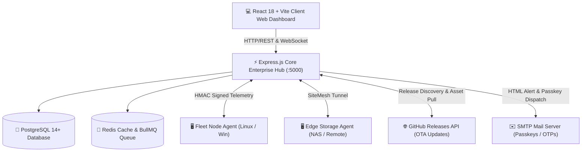

# ⚡ Homecloud (NexaDisk v2 Enterprise)

<p align="center">
  <strong>Autonomous Self-Hosted Cloud Storage, Zero-Trust File Mesh & Distributed Fleet Orchestration</strong>
</p>

<p align="center">
  
  =18.0.0-green.svg?style=for-the-badge&logo=node.js" alt="Node.js" />
  
  
  
  
</p>

---

## 🌟 Overview

**Homecloud (NexaDisk v2)** is an enterprise-grade, high-performance personal cloud platform and distributed storage orchestrator. Designed for homelabs, remote offices, and multi-node clusters, it delivers seamless cloud storage management, automated tiering, zero-trust security access gates, anti-malware threat radar, and live telemetry across all your machines.

---

## ✨ Key Platform Features

### 🗄️ 1. Modern Workspace & High-Speed File Gateway
- **Interactive File Explorer:** Ultra-responsive directory browser with glassmorphic dark UI, drag-and-drop uploads, instant multi-file batch downloads, and folder ZIP streaming.
- **In-Memory Media Streamer:** Smooth inline streaming for 4K video, audio, high-res photos, and high-performance PDF blob rendering without frameguard blocks.
- **Smart Search & Tagging:** Full-text recursive search with custom color-coded labels, starred favorites, and duplicate detection.

### 🛡️ 2. Zero-Trust Security & SOC Center
- **Anti-Malware Threat Radar:** ClamAV & YARA-powered asynchronous scanning queue with quarantine vault and sha256 checksum integrity monitoring.
- **Canary Decoy & Ransomware Shield:** Trapdoor honey-pot file watchdogs that auto-lock accounts and trigger alerts upon ransomware tampering.
- **Passkey & MFA (TOTP) Security:** Two-Factor Authentication via Google Authenticator / Authy, combined with admin remote recovery controls.
- **Rate-Limiting & Brute-Force Lockout:** IP-level throttling with progressive ban logic across password and OTP verification endpoints.

### ⚡ 3. Automated Storage Tiering & Deduplication
- **Lifecycle Policies:** Automated HOT (NVMe/SSD), WARM (HDDs/NAS), and COLD (S3 Glacier/R2) migration rules based on file age and patterns.
- **Block & Fingerprint Deduplication:** Fast non-blocking chunk and SHA-256 fingerprint analyzer to identify duplicate files and reclaim wasted drive space.
- **Point-in-Time Snapshots:** Atomic manifest creation and state recovery snapshots.

### 🌐 4. Multi-Site Cluster Mesh & Remote Fleet Agents
- **Zero-Port-Forwarding Reverse Tunneling:** Connect remote homelabs, edge nodes, and secondary sites across NAT/firewalls into a single unified topology.
- **Autonomous Node Provisioning:** 1-line PowerShell & Bash pairing scripts for instant Windows and Linux agent enrollment.
- **Fleet Storage Aggregation:** Real-time CPU, RAM, and disk telemetry streaming from all connected agent machines.

### ✉️ 5. Multi-Channel Alert Gateway
- **Real SMTP Email Engine:** Instant HTML email passkey delivery for share links and guest portals with configurable mail server settings.
- **Discord & Telegram Webhooks:** Live dispatch for system alerts, rogue login attempts, storage threshold breaches, and node disconnections.

### 📦 6. Centralized GitHub Releases OTA Update Engine
- **One-Click Live Upgrades:** Seamless discovery of new releases from `ramhomelabs-art/Homecloud` via GitHub Releases API.
- **Atomic Pre-Flight Backup:** Automatically creates a rollback snapshot (`backups/snap_*_pre_update.zip`) before touching runtime files.
- **Automated Rollback & Staging:** Downloads release tarballs/zips, extracts application code, preserves `.env` and user uploads, and triggers auto-rollback if any step fails.
- **GitHub Actions CI/CD Pipeline:** Automated packaging workflow (`.github/workflows/release.yml`) that compiles frontend bundles and creates GitHub Releases upon pushing tags (`v*`).

---

## 🏛️ System Architecture



---

## 🚀 Quick Start & Installation

### Option A: Manual Setup (Windows & Linux)

#### 1. Clone Repository & Install Dependencies
```bash
git clone https://github.com/ramhomelabs-art/Homecloud.git nexadisk-v2
cd nexadisk-v2

# Install Server Dependencies
cd server
npm install --legacy-peer-deps
cd ..

# Install Client Dependencies & Build Frontend
cd client
npm install --legacy-peer-deps
npm run build
cd ..
```

#### 2. Configure Environment
Copy the configuration template:
```bash
cp .env.example .env
```
Edit `.env` and set your PostgreSQL credentials and a secure `JWT_SECRET` and `AGENT_KEY`:
```ini
PORT=5000
NODE_ENV=production
JWT_SECRET=your_long_random_jwt_secret_64_characters_min
AGENT_KEY=your_agent_pairing_secret_key
DB_USER=postgres
DB_PASSWORD=postgres
DB_HOST=localhost
DB_DATABASE=nexadisk
DB_PORT=5432
```

#### 3. Start Database & NexaDisk Server
```bash
# Start Server
cd server
node index.js
```
Access the web dashboard at: `http://localhost:5000`

---

### Option B: Docker Compose

```bash
docker-compose up -d --build
```
This automatically initializes PostgreSQL, Redis, and the NexaDisk Enterprise Server container.

---

## 🛠️ Release Packaging & Distribution

### Building a Local Release Package
You can package the full production bundle locally into `dist-release/`:
```bash
node scripts/package_release.js
```
This automatically:
1. Compiles the Vite React frontend bundle (`client/dist`).
2. Packages the server, agent, and distribution files into `dist-release/nexadisk-v*.zip`.
3. Calculates SHA-256 cryptographic checksums.

### Publishing an Automated GitHub Release
Push any version tag to trigger the GitHub Actions CI/CD release workflow:
```bash
git tag -a v2.4.0 -m "NexaDisk v2.4.0 Enterprise Release"
git push origin v2.4.0
```
GitHub Actions will automatically build, package, and publish the release with assets and checksums to the repository Releases page!

---

## ⚙️ Configuration Reference

| Environment Variable | Description | Default |
|---|---|---|
| `PORT` | HTTP Server port | `5000` |
| `NODE_ENV` | Environment mode (`development` / `production`) | `production` |
| `JWT_SECRET` | Secret key for JWT signing & zero-trust auth | Required |
| `AGENT_KEY` | Secret token for remote fleet node pairing | Required |
| `DB_HOST` | PostgreSQL Host address | `localhost` |
| `DB_PORT` | PostgreSQL Port | `5432` |
| `DB_USER` | PostgreSQL Username | `postgres` |
| `DB_PASSWORD` | PostgreSQL Password | `postgres` |
| `DB_DATABASE` | PostgreSQL Database name | `nexadisk` |
| `REDIS_HOST` | Redis Cache Host | `localhost` |
| `REDIS_PORT` | Redis Cache Port | `6379` |
| `USE_IN_MEMORY_QUEUE` | Fallback in-memory queue when Redis is offline | `true` |
| `GITHUB_REPO` | Target GitHub repository for OTA update checks | `ramhomelabs-art/Homecloud` |

---

## 🔒 Security Best Practices

- **Never commit `.env`** or database credentials to GitHub.
- Use unique, high-entropy random keys for `JWT_SECRET` and `AGENT_KEY`.
- Enable **Two-Factor Authentication (TOTP 2FA)** on all Administrator accounts.
- Configure an **SMTP Mail Server** in Settings to deliver access passkeys and critical system alerts.

---

## 📄 License

Distributed under the **MIT License**. See `LICENSE` for more information.

<p align="center">
  Built with ❤️ for autonomous self-hosted homelabs and enterprise storage clusters.
</p>
